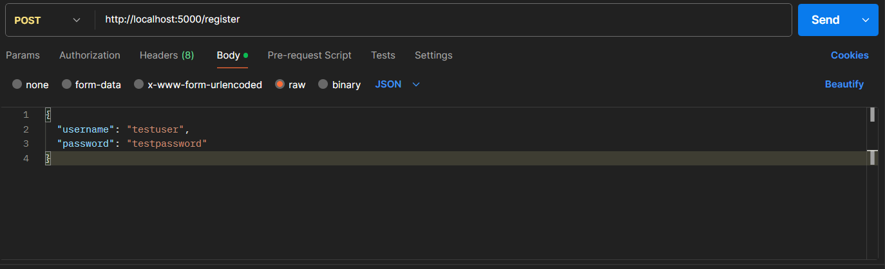

# Authentication Service

Dieses Projekt implementiert ein Proof-of-Concept (PoC) für ein **Authentifizierungssystem** in einer verteilten Anwendung. Es bietet zwei Authentifizierungsmethoden: **Token-basierte Authentifizierung** und **Username/Passwort-basierte Authentifizierung**.

---

## **Projektübersicht**

- **Ziel:** Demonstration von Authentifizierungstechniken in einer verteilten Architektur.
- **Ansatz:** Vergleich und Integration von Token- und Username/Passwort-basierten Authentifizierungsmethoden.
- **Ergebnis:** Ein vollständig funktionales, containerisiertes System, das die Grundlagen moderner Authentifizierungsmethoden zeigt.

---

## **Projektstruktur**


---

## **Erklärungen zu den Abschnitten**

### **password_auth_service/**
Dieser Ordner enthält den Code für die Username/Passwort-basierte Authentifizierung.

- **main.py**: Der Hauptcode, der die Endpunkte für Benutzerregistrierung und -Authentifizierung implementiert.
- **requirements.txt**: Die benötigten Python-Abhängigkeiten für diesen Service.
- **Dockerfile**: Zum Containerisieren des Services.

---

### **sample_service/**
Dieser Ordner enthält den Beispielservice, der beide Authentifizierungsmethoden integriert.

- **main.py**: Der Hauptcode, der auf die beiden Authentifizierungsservices zugreift.
- **requirements.txt**: Die benötigten Python-Abhängigkeiten.
- **Dockerfile**: Zum Containerisieren des Services.

---

### **token_auth_service/**
Dieser Ordner enthält den Code für die JWT-basierte Authentifizierung.

- **main.py**: Der Hauptcode, der die Endpunkte für Token-Generierung und -Validierung implementiert.
- **requirements.txt**: Die benötigten Python-Abhängigkeiten für diesen Service.
- **Dockerfile**: Zum Containerisieren des Services.

---

### **docker-compose.yml**
Ermöglicht die gleichzeitige Ausführung aller Services in Containern.

---

### **README.md**
Dokumentation des Projekts.

---

## **Voraussetzungen**

1. **[Docker](https://www.docker.com/products/docker-desktop/)**: Version 20.10 oder neuer.  
   Lade Docker Desktop für Windows, macOS oder Linux herunter, um Container zu erstellen und auszuführen.

2. **[Postman](https://www.postman.com/downloads/)**: Für API-Tests.  
   Lade Postman herunter, um HTTP-Anfragen an deine API zu senden und die Antworten zu testen.

3. **[Git](https://git-scm.com/downloads/)**: Zum Klonen des Repositories.  
   Installiere Git, um Repositories von Plattformen wie GitHub zu clonen und Änderungen zu verwalten.

---

## **Schritt 1: Git Repository Clonen**

**Wichtig:** Bitte wie unter Kapitel Voraussetzung beschrieben zuerst Git installieren, bevor diese Schritte durchgeführt werden.

### Schritte
1. Öffne die  Eingabeaufforderung.  

2. Navigiere zu dem Ordner, in dem du das Repository speichern möchtest:  

   ```bash
   cd pfad/zum/ordner

3. Clone das Repository mit folgendem Befehl:
    ```bash
    git clone https://github.com/NithurjanA/SD4_Authentication.git

4. Git erstellt automatisch einen neuen Ordner mit dem Namen des Repositories (SD4_Authentication) und lädt alle Dateien in diesen Ordner.

Jetzt sollten die Daten aus dem Git-Repository auf deinem Computer im angegebenen Pfad heruntergeladen worden sein, und du kannst mit dem nächsten Schritt fortfahren.

---

## **Schritt 2: Docker starten und docker-compose ausführen**

### Docker starten und ausführen
1. Die Anwendung "Docker Desktop" starten, da es ausgeführt sein muss.


2. Öffne die Eingabeaufforderung.

3. Navigiere zum Pfad wo Github heruntergeladen wurde und gehe eine Ebene im Ordner SD4_Authentication rein zu "distributed_auth_system". Ungefähr so sollte sollte es aussehen (je nach Speicherort sieht es bei dir anders aus):


4. Führe den folgenden Befehl aus, um alle Services zu bauen und zu starten:
    ```bash
    docker-compose up --build

### **Verfügbare Services**

Nach dem erfolgreichen Start von `docker-compose up --build` sind die folgenden Services aktiv:

#### **1. Password Auth Service**
- **URL:** [http://localhost:5000](http://localhost:5000)
- **Beschreibung:** 
  Dieser Service bietet die Username/Passwort-basierte Authentifizierung. Er ist unter der IP-Adresse `http://127.0.0.1:5000` verfügbar.
- **Verfügbare Endpunkte:**
  - `POST /register`: Registriert neue Benutzer.
  - `POST /login`: Authentifiziert bestehende Benutzer.
- **Statusmeldungen:**
  - Der Service läuft im Debug-Modus.
  - Hinweis: Die Warnung `This is a development server` bedeutet, dass der Server nicht für Produktionsumgebungen geeignet ist. Für Produktion wird ein WSGI-Server wie Gunicorn empfohlen.

---

#### **2. Token Auth Service**
- **URL:** [http://localhost:5001](http://localhost:5001)
- **Beschreibung:** 
  Dieser Service implementiert die Token-basierte Authentifizierung mit JSON Web Tokens (JWT). Er ist unter der IP-Adresse `http://127.0.0.1:5001` verfügbar.
- **Verfügbare Endpunkte:**
  - `POST /generate-token`: Generiert ein neues Token für autorisierte Benutzer.
  - `POST /validate-token`: Validiert ein bestehendes Token.
- **Statusmeldungen:**
  - Der Service läuft ebenfalls im Debug-Modus mit der gleichen Warnung wie der `Password Auth Service`.

---

#### **3. Sample Service**
- **URL:** [http://localhost:5002](http://localhost:5002)
- **Beschreibung:** 
  Der Beispielservice zeigt, wie die beiden Authentifizierungsmethoden integriert werden. Er ist unter der IP-Adresse `http://127.0.0.1:5002` verfügbar.
- **Verfügbare Endpunkte:**
  - `POST /secure-data`: Zugriff auf geschützte Daten mit einem gültigen JWT.
  - `POST /profile`: Ruft Benutzerprofile basierend auf Username/Passwort-Authentifizierung ab.
- **Statusmeldungen:**
  - Der Service läuft im Debug-Modus mit ähnlichen Einschränkungen wie die anderen.

---

## **Schritt 3: Services testen**

Bitte wie unter Kapitel Voraussetzung beschrieben zuerst Postman installieren, bevor diese Schritte durchgeführt werden.

Jetzt testen wir jeden Services nacheinander.

### **1. Password Auth Service**

#### Benutzerregistierung
1. Postman öffnen
2. Klicke auf "New" und wähle "HTTP".
3. Wähle die Methode POST.
4. Gib die URL ein: http://localhost:5000/register.
5. Gehe zum Tab Body, wähle raw und stelle sicher, dass JSON ausgewählt ist.
6. Füge diesen Inhalt in den Body ein mit der gewünschen Benutzername und Passwort:

7. Klicke auf Send.

Erwartete Antwort:


Wenn eine Angabe nicht korrekt eingegeben wurde oder fehlt, kommt unten beim Body eine Fehlermeldung. Ansonsten sollte es problemlos funktionieren.

#### Benutzerlogin
Jetzt könnten wir noch verifizieren, ob der eben erstellte User mit seinem Passwort erfolgreich einloggen kann.
1. Postman öffnen
2. Klicke auf "New" und wähle "HTTP".
3. Wähle die Methode POST.
4. Gib die URL ein: http://localhost:5000/login.
5. Gehe zum Tab Body, wähle raw und stelle sicher, dass JSON ausgewählt ist.
6. Füge diesen Inhalt in den Body ein mit der korrekten Benutzername und Passwort:

7. Klicke auf Send.

Erwartete Antwort:


Wenn der Benutzername oder das Passwort nicht mit der registrierten User übereinstimmt, sollte die nachfolgende Fehlermeldung kommen:


Das ware die erste Login mit Benutzername und Passwort.

### **2. Token Auth Service **

#### Token Generierung
Jetzt testen wir den Service, der JSON Web Tokens (JWT) generiert.
1. Postman öffnen
2. Klicke auf "New" und wähle "HTTP".
3. Wähle die Methode POST.
4. Gib die URL ein: http://localhost:5001/generate-token.
5. Lass den Tab Body leer (dieser Endpunkt benötigt keinen Body).
6. Klicke auf Send.

Erwartete Antwort:
Es sollte ein Token,wie im nachfolgenden Bild ersichtlich ist, generiert und angezeigt werden.


Diesen Token müsst kopieren und in der Zwischenablage speichern, da wir es für die Validierung benötigen.

#### Token Validierung
1. Postman öffnen
2. Klicke auf "New" und wähle "HTTP".
3. Wähle die Methode POST.
4. Gib die URL ein: http://localhost:5001/validate-token.
5. Gehe zum Tab Body, wähle raw, und stelle sicher, dass JSON ausgewählt ist.
6. Füge diesen Inhalt in den Body ein, wobei der angezeigte Token durch den generierten Token, die du im vorherigen Schritt kopiert hast, ersetzt wird:

7. Klicke auf Send.

Erwartete Resultat:


**"decoded"**: iat (Issued at) zeigt wenn der Token erstellt wurde und exp (Expiration) zeigt den Zeitpunkt, zu dem der Token abläuft.

**"message"**: Token is valid Bedeutet, dass der übermittelte Token korrekt signiert ist und innerhalb seiner Gültigkeitsdauer liegt.

Wenn der Token nicht mit der zuvor generierten Token übereinstimmt, sollte die nachfolgende Meldung kommen:


### **3. Sample Services**
1. Postman öffnen
2. Klicke auf "New" und wähle "HTTP".
3. Wähle die Methode POST.
4. Gib die URL ein: http://localhost:5002/secure-data.
5. Gehe zum Tab Body, wähle raw, und stelle sicher, dass JSON ausgewählt ist.
6. Füge diesen Inhalt in den Body ein, wobei der angezeigte Token durch den generierten Token, die du im vorherigen Schritt kopiert hast, ersetzt wird:

7. Klicke auf Send.

Erwartete Antwort:


Wozu dieser Schritt:
**Zugriffskontrolle:** Der Endpunkt prüft, ob ein gültiges Token im Body der Anfrage übermittelt wurde. Nur wenn das Token gültig ist (z. B. nicht abgelaufen und korrekt signiert), erhält der Benutzer Zugriff auf die geschützten Daten.
**Zugriffskontrolle:** Die geschützten Daten werden nicht an Benutzer ausgegeben, die kein gültiges Token übermitteln. Dadurch wird sichergestellt, dass nur authentifizierte und autorisierte Benutzer auf die Daten zugreifen können.
**Praktisches Beispiel:** In einer realen Anwendung könnte dieser Endpunkt sensible Informationen wie Benutzerdaten, Rechnungen oder andere geschützte Ressourcen bereitstellen. Das Beispiel hier zeigt, dass ein gültiges Token den Zugriff auf eine einfache Antwort wie "Secure data with Token Auth" gewährt.

Wenn der Token mit dem zuvor generierten Token nicht übereinstimmt, sollte eine Fehlermeldung erscheinen:


#### **4. Benutzerprofil abrufen**
1. Postman öffnen
2. Klicke auf "New" und wähle "HTTP".
3. Wähle die Methode POST.
4. Gib die URL ein: http://localhost:5002/profile.
5. Gehe zum Tab Body, wähle raw, und stelle sicher, dass JSON ausgewählt ist.
6. Füge diesen Inhalt in den Body ein:

7. Klicke auf Send.

Erwartete Resultat:


Wenn der Benutzername oder das passwort nicht richtig ist, sollt eine Fehlermeldung erscheinen:


